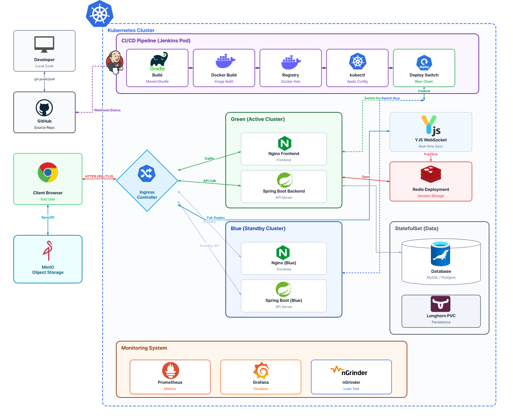

# FileInNOut DevOps Project

<div align="center">
  
</div>

<br />

FileInNOut는 파일 저장소, 실시간 문서 편집, 채팅, 알림, 그룹 공유 기능을 하나의 협업 환경으로 제공하는 서비스입니다.  
이 저장소는 애플리케이션 기능뿐 아니라 **컨테이너 빌드, CI/CD 자동화, Kubernetes 배포, Helm 차트 운영, 상태 저장 컴포넌트 관리**를 함께 다루는 DevOps 중심 프로젝트입니다.

## 목차

- [서비스 개요](#서비스-개요)
- [DevOps 목표](#devops-목표)
- [아키텍처](#아키텍처)
- [기술 스택](#기술-스택)
- [저장소 구조](#저장소-구조)
- [CI/CD 파이프라인](#cicd-파이프라인)
- [Kubernetes와 Helm](#kubernetes와-helm)
- [로컬 실행](#로컬-실행)
- [환경 변수](#환경-변수)
- [성능 테스트와 문서](#성능-테스트와-문서)
- [운영 체크리스트](#운영-체크리스트)

## 서비스 개요

FileInNOut는 업무 전환 비용을 줄이기 위해 파일 관리, 문서 협업, 실시간 커뮤니케이션을 하나의 흐름으로 묶은 클라우드 협업 플랫폼입니다.

주요 기능은 다음과 같습니다.

| 영역 | 기능 |
| --- | --- |
| 파일 관리 | 폴더/파일 업로드, 다운로드, 휴지통, 공유 링크, 썸네일, 텍스트 미리보기 |
| 문서 협업 | Editor.js와 Yjs 기반 실시간 문서 작성, 워크스페이스 공유, 권한 관리 |
| 커뮤니케이션 | 채팅방, WebSocket/STOMP 메시지, SSE 알림, 읽음/접속 상태 |
| 사용자/조직 | JWT 인증, OAuth2 로그인, 그룹/관계/초대 관리 |
| 운영 기능 | 관리자 대시보드, 저장소 용량 관리, 결제 연동, nGrinder 부하 테스트 스크립트 |

## DevOps 목표

이 프로젝트에서 중점적으로 설계한 DevOps 목표입니다.

1. **빌드 표준화**  
   Backend, Frontend, WebSocket 서버를 Docker 이미지로 패키징하고 동일한 런타임 방식으로 배포합니다.

2. **배포 자동화**  
   Jenkins Kubernetes Agent, Kaniko, Helm을 사용해 이미지 빌드부터 Kubernetes 반영까지 자동화합니다.

3. **무중단 배포 기반 구성**  
   Argo Rollouts의 Blue-Green 전략을 사용해 Backend, Frontend, WebSocket 서버의 안정적인 교체 배포를 목표로 합니다.

4. **상태 저장 서비스 운영**  
   MariaDB와 Redis를 StatefulSet/PVC 기반으로 구성하고 Longhorn StorageClass를 사용해 데이터 영속성을 확보합니다.

5. **운영 안정성 확보**  
   readiness/liveness/startup probe, preStop hook, PDB, HPA 템플릿, Ingress timeout 설정을 통해 장애 전파를 줄입니다.

## 아키텍처


<div align="center">
  
</div>

## 기술 스택

| 구분 | 기술 |
| --- | --- |
| Frontend | Vue 3, Vite, Pinia, Tailwind CSS, Axios, Nginx |
| Backend | Java 17, Spring Boot 3.2.5, Spring Security, JPA, OAuth2, JWT |
| Realtime | WebSocket, STOMP, SSE, Yjs, Node.js WebSocket Server |
| Data | MariaDB, Redis, MinIO, Amazon S3 호환 스토리지 |
| CI/CD | Jenkins Pipeline, Kubernetes Agent, Kaniko, Docker Hub |
| Kubernetes | Helm, Argo Rollouts, Ingress Nginx, StatefulSet, PVC, HPA, PDB |
| Test/Docs | JUnit, Swagger/OpenAPI, nGrinder |

## 저장소 구조

```text
.
├── backend/                    # Spring Boot API 서버
│   ├── src/                     # 도메인별 API, 서비스, 설정
│   ├── docs/                    # Swagger/OpenAPI 문서와 프로젝트 문서
│   ├── ngrinder/                # 부하 테스트 스크립트
│   ├── helm/                    # Backend 기준 Helm 차트 복사본
│   └── websocket-server/        # Yjs WebSocket 서버
├── frontend/                   # Vue 3 프론트엔드
│   ├── src/                     # 화면, 컴포넌트, API 모듈
│   └── public/                  # 정적 리소스와 게임 리소스
├── devops/
│   ├── Docker/                  # Backend, Frontend, WebSocket Dockerfile
│   ├── Jenkins/                 # Backend/Frontend Jenkins Pipeline
│   ├── Kubes/                   # Kubernetes 원본 매니페스트
│   └── Helm/                    # 운영 배포용 Helm Chart
└── README.md
```

## CI/CD 파이프라인

Jenkins 파이프라인은 `devops/Jenkins`에 분리되어 있습니다.

### Backend Pipeline

파일: `devops/Jenkins/backend.Jenkinsfile`

| 단계 | 내용 |
| --- | --- |
| Checkout Sources | 애플리케이션 저장소와 Helm 저장소를 체크아웃 |
| Gradle Build | `./gradlew clean bootJar -x test`로 실행 가능한 JAR 생성 |
| Helm Sanity Check | `helm lint`, `helm template` 결과에서 Rollout/StatefulSet 렌더링 검증 |
| Kaniko Build & Push | Backend 이미지를 `lumisia/backend:v${BUILD_NUMBER}`와 `latest`로 push |
| Deploy Helm Stack | `helm upgrade --install --atomic --wait`로 Kubernetes 배포 |

### Frontend/WebSocket Pipeline

파일: `devops/Jenkins/frontend.Jenkinsfile`

| 단계 | 내용 |
| --- | --- |
| Frontend Build | `npm ci`, `npm run build`로 Vue 정적 파일 생성 |
| Kaniko Build & Push | Frontend 이미지와 WebSocket 서버 이미지를 빌드 후 push |
| Deploy to Kubernetes | Rollout 또는 Deployment의 컨테이너 이미지를 patch |
| Rollout Wait | Argo Rollout의 `Healthy` 상태를 확인하고 실패 시 YAML 출력 |

### Jenkins 실행 전 준비

| 항목 | 설명 |
| --- | --- |
| Docker Registry Secret | Kaniko가 사용할 `dockerhub-cred` Secret 필요 |
| Kubernetes 권한 | Jenkins Pod의 `jenkins-deployer` ServiceAccount에 배포 권한 필요 |
| Helm Secret Values | 운영 민감값은 Jenkins Secret File Credential로 주입 권장 |
| Dockerfile 경로 | Jenkinsfile의 기본 Dockerfile/Repository 값은 실행 환경에 맞게 확인 필요 |
| 배포 브랜치 | 기본적으로 `main` 브랜치 또는 `FORCE_DEPLOY=true`일 때 배포 |

## Kubernetes와 Helm

운영 배포의 중심은 `devops/Helm` 차트입니다.

### 주요 컴포넌트

| 컴포넌트 | Kubernetes 리소스 | 설명 |
| --- | --- | --- |
| Backend | Argo Rollout, Service, ConfigMap, PDB | Spring Boot API 서버 |
| Frontend | Argo Rollout, Service, ConfigMap, PDB | Nginx 기반 Vue 정적 파일 서버 |
| WebSocket | Argo Rollout, Service, ConfigMap, PDB, HPA | Yjs 실시간 협업 서버 |
| Redis | StatefulSet, Headless Service, PVC, HPA | 세션, 실시간 이벤트, Yjs 상태 공유 |
| Redis Sentinel | Deployment, Service, PDB | Redis 고가용성 옵션 |
| MariaDB | StatefulSet, Headless Service, PVC | 서비스 메인 데이터베이스 |
| Ingress | Ingress Nginx | Frontend, Backend, WebSocket 라우팅과 TLS |

### Helm values 핵심

파일: `devops/Helm/values.yaml`

| 영역 | 주요 설정 |
| --- | --- |
| Image | `backend.image`, `frontend.image`, `websocket.image` |
| Rollout | `*.rollout.blueGreen.autoPromotionEnabled`, `scaleDownDelaySeconds` |
| Resource | 각 컴포넌트의 CPU/Memory request와 limit |
| Redis | persistence, maxmemory, sentinel, autoscaling |
| MariaDB | Longhorn PVC, MariaDB 11.4, bootstrap job |
| Ingress | TLS Secret, host, proxy timeout, WebSocket/SSE 옵션 |
| Secret Values | JWT, OAuth2, DB, Mail, Storage, PortOne 값은 private values로 분리 권장 |

### Helm 명령 예시

```bash
helm lint ./devops/Helm
```

```bash
helm template waffle-release ./devops/Helm \
  --namespace helm-service
```

```bash
helm upgrade --install waffle-release ./devops/Helm \
  --namespace helm-service \
  --create-namespace \
  -f values.private.yaml \
  --set-string backend.image.tag=v1 \
  --set-string frontend.image.tag=v1 \
  --set-string websocket.image.tag=v1 \
  --wait \
  --timeout 15m \
  --atomic
```

Kustomize 기반 원본 매니페스트는 다음 명령으로 확인할 수 있습니다.

```bash
kubectl apply -k ./devops/Kubes
```

## 로컬 실행

로컬에서는 Redis, MariaDB, MinIO만 Docker Compose로 띄우고 애플리케이션은 각각 개발 서버로 실행하는 방식이 가장 단순합니다.

### 1. 인프라 컨테이너 실행

`backend/.env` 또는 현재 쉘 환경에 DB/MinIO 값을 먼저 준비합니다.

```bash
cd backend
docker compose up -d redis db minio
```

### 2. Backend 실행

```bash
cd backend
./gradlew bootRun
```

Backend 기본 포트는 `8080`, API context path는 `/api`입니다.

### 3. WebSocket 서버 실행

```bash
cd backend/websocket-server
npm install
npm start
```

WebSocket 서버 기본 포트는 `1234`입니다.

### 4. Frontend 실행

```bash
cd frontend
npm ci
npm run dev
```

### 5. 빌드 확인

```bash
cd backend
./gradlew clean bootJar -x test
```

```bash
cd frontend
npm run build
```

## 환경 변수

민감 정보는 Git에 커밋하지 않고 로컬 `.env`, Jenkins Credential, `values.private.yaml`, Kubernetes Secret 중 하나로 관리합니다.

### Backend

| 분류 | 변수 |
| --- | --- |
| App URL | `APP_FRONTEND_URL`, `APP_BACKEND_URL`, `APP_SECURE_COOKIE` |
| JWT/Admin | `JWT_KEY`, `JWT_EXPIRE`, `ADMIN_EMAIL`, `ADMIN_NAME`, `ADMIN_ROLE`, `ADMIN_PASSWORD`, `ADMIN_ADDITIONAL_USERS` |
| Database | `DB_SERVER`, `DB_URL`, `DB_ID`, `DB_PASS` |
| Redis | `REDIS_HOST`, `REDIS_PORT`, `REDIS_SENTINEL_MASTER`, `REDIS_SENTINEL_NODES` |
| OAuth2 | `GOOGLE_CLIENT_ID`, `GOOGLE_CLIENT_SECRET`, `NAVER_CLIENT_ID`, `NAVER_CLIENT_SECRET`, `KAKAO_CLIENT_ID`, `KAKAO_CLIENT_SECRET` (`CLIENT_ID`, `CLIENT_SECRET` legacy fallback) |
| Mail | `MAIL_PORT`, `MAIL_ID`, `MAIL_PASS` |
| Storage | `STORAGE_PROVIDER`, `MINIO_API`, `MINIO_PUBLIC_API`, `MINIO_NAME`, `MINIO_SECRET`, `MINIO_CLOUD_BUCKET`, `MINIO_WORKSPACE_BUCKET`, `MINIO_REGION` |
| S3 | `S3AMAZON_API`, `S3AMAZON_PUBLIC_API`, `S3AMAZON_NAME`, `S3AMAZON_SECRET`, `S3AMAZON_CLOUD_BUCKET`, `S3AMAZON_WORKSPACE_BUCKET`, `S3AMAZON_REGION` |
| Payment | `PORTONE_SECRET` |

### WebSocket 서버

| 변수 | 설명 |
| --- | --- |
| `PORT`, `HOST` | WebSocket 서버 바인딩 정보 |
| `REDIS_HOST`, `REDIS_PORT` | Redis 연결 정보 |
| `REDIS_SENTINEL_MASTER`, `REDIS_SENTINEL_NODES` | Sentinel 사용 시 연결 정보 |
| `BACKEND_HOST`, `BACKEND_PORT` | Backend API 연결 정보 |
| `YJS_REDIS_PREFIX` | Yjs Redis key prefix |
| `YJS_SNAPSHOT_SAVE_DELAY_MS` | 문서 스냅샷 저장 지연 시간 |

## 성능 테스트와 문서

### API 문서

- Swagger UI 정적 문서: `backend/docs/index.html`
- OpenAPI JSON: `backend/docs/api-docs.json`
- 배포 환경 예시: `https://api.fileinnoutcloud.kro.kr/swagger-ui/index.html`

### nGrinder

`backend/ngrinder`에는 도메인별 부하 테스트 스크립트가 정리되어 있습니다.

| 디렉터리 | 대상 |
| --- | --- |
| `auth`, `user` | 인증, 회원 |
| `file` | 업로드, 다운로드, 공유, 관리 |
| `workspace` | 워크스페이스, 문서, 에셋 |
| `chat`, `chatRoom` | 채팅 메시지와 채팅방 |
| `group` | 그룹, 관계, 공유 |
| `notification`, `sse` | 알림, SSE 연결 |
| `game` | 실시간 게임 WebSocket |

## 운영 체크리스트

배포 전 확인하면 좋은 항목입니다.

- `helm lint ./devops/Helm` 통과 여부
- `helm template` 결과에 Rollout, Service, Ingress, PVC가 의도대로 렌더링되는지 확인
- Docker 이미지 태그가 `latest`만 의존하지 않고 빌드 번호 태그로도 배포되는지 확인
- `values.private.yaml` 또는 Jenkins Credential에 운영 secret이 누락되지 않았는지 확인
- Ingress TLS Secret과 host가 운영 도메인과 일치하는지 확인
- Redis와 MariaDB PVC의 StorageClass가 클러스터에 존재하는지 확인
- Argo Rollouts Controller와 CRD가 클러스터에 설치되어 있는지 확인
- WebSocket/SSE 경로의 Ingress timeout과 buffering 옵션이 유지되는지 확인
- 장애 시 `kubectl get rollout.argoproj.io -n helm-service`와 `kubectl describe pod`로 원인 확인

## 개선 예정 포인트

- External Secrets 또는 Sealed Secrets 도입으로 secret 관리 강화
- Prometheus/Grafana 기반 메트릭 대시보드 구성
- OpenTelemetry Collector와 Jaeger 연동 구체화
- 이미지 취약점 스캔과 SBOM 생성 단계 추가
- Argo CD 기반 GitOps 배포 흐름으로 확장

## 배포 테스트


## Desktop Sync Client

The repository includes a launchable Windows-oriented desktop sync client in
`desktop-client/`. It syncs configured FileInNOut cloud folders with normal
local Windows folders and supports recursive folder sharing.

Install:

```powershell
powershell -ExecutionPolicy Bypass -File .\desktop-client\install-windows.ps1
```

Create and verify a Windows release zip:

```powershell
powershell -ExecutionPolicy Bypass -File .\desktop-client\package-windows.ps1
powershell -ExecutionPolicy Bypass -File .\desktop-client\verify_windows_package.ps1
```

Create the Windows desktop installer package served by the sidebar desktop
install button:

```powershell
$env:FILEINNOUT_PYTHON_RUNTIME="C:\Path\To\PortablePython"
powershell -ExecutionPolicy Bypass -File .\desktop-client\package-windows-exe.ps1
```

The generated ZIP package is copied to
`frontend\public\downloads\FileInNOutDesktop.zip` and to a versioned
`FileInNOutDesktop-<version>.zip` path. The sidebar download button points to
the versioned ZIP path so browsers do not reuse an older EXE download URL. The
ZIP contains `FileInNOutDesktopSetup.exe`; extract the ZIP, then run that setup
executable.

The setup executable now opens a Windows installer with a progress bar and a
desktop-shortcut choice. It installs `FileInNOutDesktop.exe`, a blue folder tray
app. Double-click the tray icon to open the softer blue desktop dashboard,
login without typing a raw server URL, choose configured sync folders, choose
two-way/upload-only/download-only sync, share folders, view drive capacity, run
sync, open the web app, view local synced files, and manage notifications.
Folders received with WRITE permission can be shared onward from the desktop
app or Explorer context flow, matching the Google Drive-style shared-folder
workflow.

The package verifier validates the release manifest SHA-256 checksums and runs
a temporary Windows install/uninstall smoke test, including Start Menu
shortcuts, optional desktop shortcut creation, installed-app registration, the
blue folder icon, the tray app executable, and logon startup entry creation. If
Python is not on `PATH`, pass `-PythonPath C:\Path\To\python.exe` to the package
verifier and `-PythonExe C:\Path\To\python.exe` to `install-windows.ps1`.

Run the local launch-readiness suite before moving to a VM:

```powershell
python .\deploy\two-vm\tools\verify_launch_readiness.py
```

For a stronger local launch gate that also runs the shared-folder desktop E2E
inside Docker with admin-only login still enabled, add the admin-only shared
smoke option:

```powershell
python .\deploy\two-vm\tools\verify_launch_readiness.py --include-admin-only-shared-e2e --smoke-skip-build
```

Run the local Docker smoke when Docker Desktop is available. It starts the
two-VM stack on high local ports, verifies admin-only login, and runs the
desktop upload/pull/delete smoke through both the repo script and the installed
`fileinnout-desktop.cmd` command:

```powershell
python .\deploy\two-vm\tools\verify_local_docker_smoke.py
```

To exercise the shared-folder desktop workflow locally under the default
admin-only deployment rules, run the same smoke in admin-only shared E2E mode.
This starts a fresh local stack, bootstraps a second admin with
`ADMIN_ADDITIONAL_USERS`, confirms signup is blocked, and verifies WRITE and
READ shared-folder round trips through the desktop client. It also verifies
installed-command upload/pull/delete against the live backend:

```powershell
python .\deploy\two-vm\tools\verify_local_docker_smoke.py --admin-only-shared-e2e --skip-build
```

For the full VMware launch gate, follow
`deploy/two-vm/LAUNCH_CHECKLIST.md`.

After creating the VMware VMs, deploy and immediately verify the admin-only
stack with:

```powershell
$env:VM_PASSWORD="<vm-password>"
python .\deploy\two-vm\tools\remote_deploy.py --verify-admin-only --verify-diagnostics-on-fail
```

To verify shared folders on that admin-only stack, also set a second admin and
matching verifier credentials before running the same deploy command:

```powershell
$env:FILEINNOUT_ADMIN_ADDITIONAL_USERS="teammate@fileinnout.local|TeamAdmin|<team-admin-password>"
$env:FILEINNOUT_SHARED_ADMIN_EMAIL="teammate@fileinnout.local"
$env:FILEINNOUT_SHARED_ADMIN_PASSWORD="<team-admin-password>"
```

Installer-assisted setup can also register the app in Windows installed apps,
create Start Menu shortcuts, create the local sync folder, save login, register
a Windows logon startup entry, and start the watcher:

```powershell
powershell -ExecutionPolicy Bypass -File .\desktop-client\install-windows.ps1 `
  -Configure `
  -SyncDir C:\FileInNOut `
  -Server http://192.168.35.151/api `
  -Email admin@fileinnout.local `
  -InstallStartupTask `
  -StartNow
```

Login and initialize a sync folder:

```powershell
%LOCALAPPDATA%\FileInNOutDesktop\fileinnout-desktop.cmd login --server http://192.168.35.151/api --email admin@fileinnout.local
mkdir C:\FileInNOut
%LOCALAPPDATA%\FileInNOutDesktop\fileinnout-desktop.cmd init --dir C:\FileInNOut
```

Sync configured folders once or keep syncing them:

```powershell
%LOCALAPPDATA%\FileInNOutDesktop\fileinnout-desktop.cmd sync-configured
%LOCALAPPDATA%\FileInNOutDesktop\fileinnout-desktop.cmd status --local-only
%LOCALAPPDATA%\FileInNOutDesktop\fileinnout-desktop.cmd doctor --local-only
%LOCALAPPDATA%\FileInNOutDesktop\fileinnout-desktop.cmd watch-configured --interval 20
```

Share a synced folder by relative path:

```powershell
%LOCALAPPDATA%\FileInNOutDesktop\fileinnout-desktop.cmd share --path TeamFolder --email teammate@example.com --permission WRITE
```

For a new local folder, add `--push-first` so the client uploads it before
sharing. Repeat `--email` or use comma-separated addresses for multiple
recipients.

Recipients pull shared folders under `C:\FileInNOut\Shared\<owner-email>\`.
Folders shared with `WRITE` permission accept recipient-created files and
folders from the desktop sync client.
`sync-configured` only syncs the configured folder mappings instead of pulling
the entire cloud drive. Each mapping can be two-way, local-folder-to-cloud, or
cloud-to-local. When an old full-drive state file is reused with a new mapping,
the client resets that mapping's state first so existing local files are not
mistaken for cloud deletions.
Automatic sync stays quiet when there are no file changes, and watcher events
from `.fileinnout` metadata or temporary download files are ignored so the app
does not re-sync because of its own bookkeeping.
The client ignores common local-only temporary files such as Office `~$*`
locks, partial browser downloads, and `.tmp`/`.part`/`.swp` files.
Local deletions after a previous sync move matching owned or writable shared
cloud items to trash. Remote deletions from another synced desktop are removed
locally on the next pull when the local copy still matches the last synced
state; locally changed copies are left in place and counted as dirty skips.
When both local and remote copies changed since the last sync, the desktop
client keeps the local edit as `name (conflict YYYYMMDD-HHMMSS).ext` and
restores the original path to the current remote version.
The Windows startup entry is named `FileInNOutDesktopSync`; it uses a scheduled
task when permitted and falls back to a current-user Startup shortcut if Task
Scheduler registration is denied. The fallback uses a hidden `wscript.exe`
watcher launcher so a console window does not stay open at logon. Watcher logs
are in
`%LOCALAPPDATA%\FileInNOutDesktop\logs\watch.log`. The client uses
`.fileinnout\sync.lock` to prevent multiple sync processes from mutating the
same local folder at once, and writes the latest sync success/error state to
`.fileinnout\state.json`.
The installer also creates a `FileInNOut Desktop` Start Menu folder with
shortcuts for opening the sync folder, syncing now, running diagnostics, and
uninstalling.
It registers `FileInNOut Desktop` under the current user's Windows installed
apps list, so Windows Settings can launch the uninstall command.
Use `doctor` for a fuller install/config/sync-folder/backend diagnostic report.

Uninstall the desktop client from Windows:

```powershell
powershell -ExecutionPolicy Bypass -File "$env:LOCALAPPDATA\FileInNOutDesktop\uninstall-windows.ps1"
```

The default uninstall removes the installed client files, startup task, Start
Menu shortcuts, and installed-app registration while keeping the sync folder and
saved config. Add `-RemoveConfig -RemoveSyncDir` only on a disposable test user
or when the local synced files should be removed.

Live desktop sync verification requires two login-capable users. On the default
two-VM admin-only deployment, temporarily set `FILEINNOUT_ADMIN_ONLY=false` or
use another deployment with two existing users:

```powershell
python .\desktop-client\verify_live_desktop_sync.py `
  --server http://192.168.35.151/api `
  --owner-email owner@example.com `
  --owner-password "<owner-password>" `
  --recipient-email recipient@example.com `
  --recipient-password "<recipient-password>"
```

For the two-VM deployment, `deploy/two-vm/tools/verify_admin_only.py` now also
checks administrator desktop sync upload/pull/delete, and `verify_two_vm.py`
checks writable shared-folder desktop sync when admin-only mode is disabled.
If the admin-only verifier fails on VMware, rerun it with
`--diagnostics-on-fail` to collect Docker status, compose status, health probes,
and recent container logs from both VMs.
