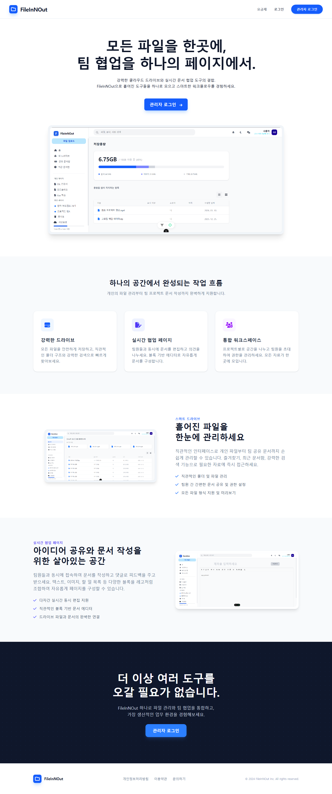
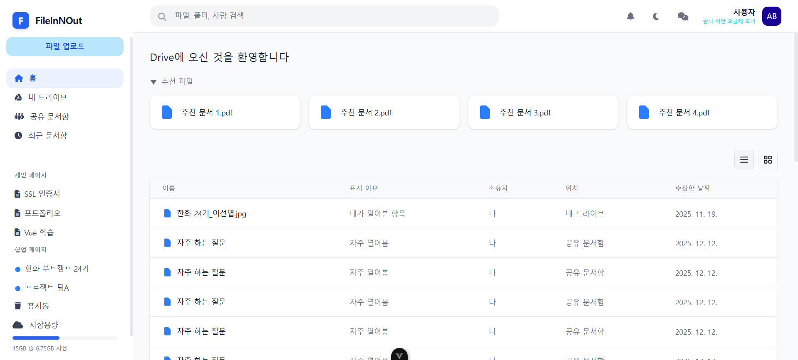
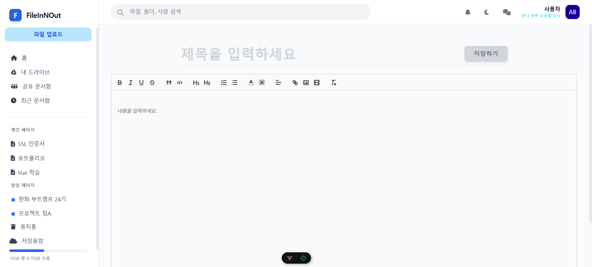
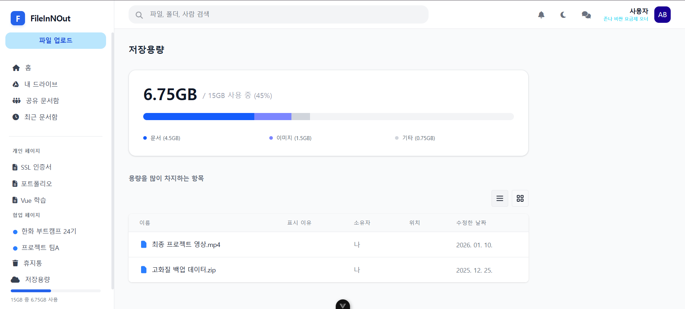
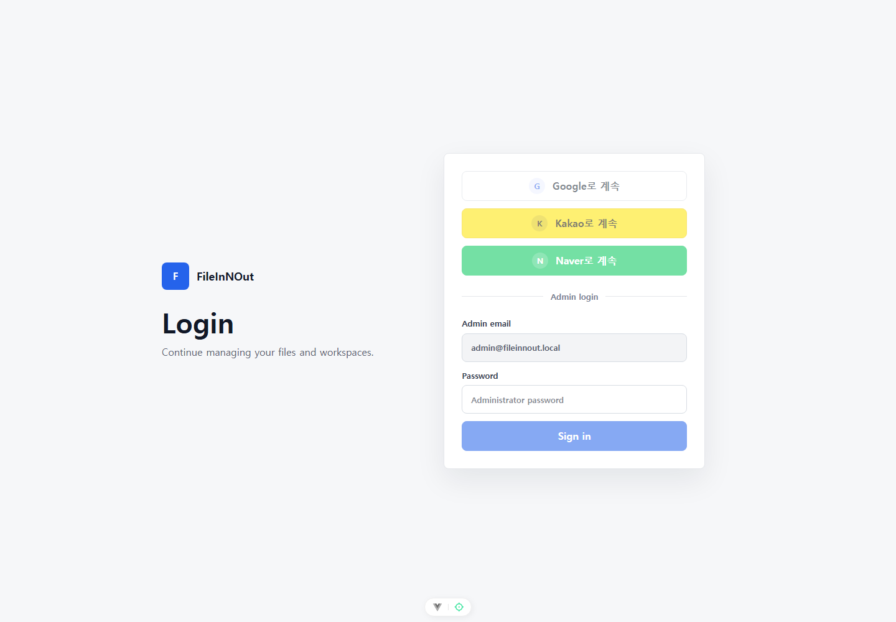
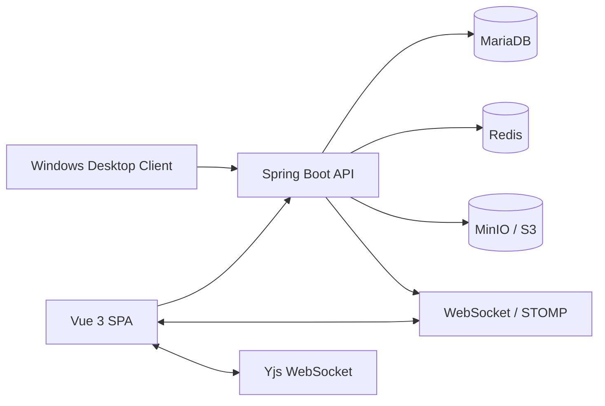

# FileInNOut Drive

> FileInNOut Drive는 웹 기반 파일 드라이브, 안전한 공유, 실시간 협업 문서, 관리자 운영 도구, Windows 동기화 클라이언트를 하나로 연결한 파일 협업 플랫폼입니다.

<p align="center">
  
</p>

<p align="center">
  <strong>Vue 3 · Spring Boot · MariaDB · Redis · MinIO/S3 · WebSocket/STOMP · Yjs · Kubernetes · Windows Desktop</strong>
</p>

## 프로젝트 한눈에 보기

| 구분 | 내용 |
| --- | --- |
| 목표 | 파일 저장과 공유 흐름, 협업 문서 작업, 운영 관리 기능을 하나의 서비스로 통합 |
| 형태 | 팀 프로젝트 기반 고도화 프로젝트 |
| 담당 | 파일 업로드/다운로드, 공유·잠금 등 파일 기능과 관리자 기능을 팀원과 구현. 이후 Windows 데스크톱 동기화 클라이언트와 설치 흐름을 개인적으로 확장 |
| 핵심 사용자 경험 | 파일을 업로드하고, 권한과 만료 조건을 제어하며, 브라우저·데스크톱에서 같은 계정의 파일을 다룸 |
| 배포 | Docker, Helm, Kubernetes 기반 배포 구성 |

## 화면 미리보기

### 파일 드라이브

<p align="center">
  
</p>

- 폴더 탐색, 파일 업로드/다운로드, 이동·이름 변경·삭제·복구
- 파일 선택 후 잠금, 공유, 다운로드 같은 일괄 작업
- 저장소 사용량과 업로드 가능 범위를 화면에서 확인

### 협업 워크스페이스

<p align="center">
  
</p>

- 블록 기반 문서 편집, 이미지·에셋 첨부, 댓글, 멤버 권한
- Yjs 기반 동시 편집과 실시간 접속 상태·이벤트 반영
- 문서 트리, 검색, 백링크, 템플릿, 작업 관리 흐름을 한 작업 공간에 제공

### 관리자 운영 화면

<p align="center">
  
</p>

- 사용자 상태와 세션, 공유 이력, 저장소 할당량을 운영 관점에서 확인
- 저장소 분석은 전송 이력 전체를 애플리케이션으로 읽지 않고 DB 집계로 계산
- 관리자 API는 권한 검사와 감사 가능한 운영 흐름을 전제로 구성

### 로그인 및 소셜 로그인 진입

<p align="center">
  
</p>

- 관리자 계정 로그인과 Google·Kakao·Naver OAuth2 로그인 구성
- Access/Refresh Token 분리, HttpOnly Refresh Cookie, 재발급 기반 세션 유지

> 이미지에는 개인 정보나 운영 비밀값이 포함되지 않습니다. 소개·로그인 화면은 현재 소스 기준 로컬 실행 화면이며, 드라이브·워크스페이스·대시보드는 프로젝트 UI 자료입니다.

## 핵심 기능

| 영역 | 구현 내용 |
| --- | --- |
| 파일 관리 | 업로드 예약과 완료 처리, 다운로드, 폴더 구조, 휴지통, 최근 파일, 미리보기 |
| 공유와 권한 | 사용자·그룹 공유, 읽기/쓰기 권한, 공유 링크, 만료 시간, 다운로드 횟수, 비밀번호 보호 |
| 파일 보호 | 파일 잠금/해제, 공유 대상 관리, 저장소 사용량·할당량 검사 |
| 협업 문서 | 실시간 공동 편집, 댓글, 멤버 초대, 문서 검색, 백링크, 에셋, 템플릿, 작업 보드 |
| 관리자 | 사용자 상태, 세션, 공유 감사, 저장소 분석, 요금제·할당량 관리 |
| 데스크톱 | Windows tray 앱, 로컬 폴더 동기화, Explorer 메뉴, 시작 프로그램·바로가기·제거 지원 |

## 아키텍처



## 기술적 문제 해결

### 파일 저장과 DB 일관성

- 업로드·공유·워크스페이스 에셋 작업에서 Object Storage I/O와 DB 트랜잭션 경계를 분리했습니다.
- 실패 시 고아 객체를 추적하고 정리할 수 있도록 cleanup job과 검증 스크립트를 구성했습니다.
- 업로드 예약량을 반영해 동시 업로드에서 할당량이 초과되지 않도록 처리했습니다.

### 로그인·실시간 연결 보안

- Refresh Token은 DB에 원문 대신 SHA-256 해시로 저장합니다.
- STOMP 연결은 Access Token만 허용하며, 연결 시 사용자 상태를 DB에서 확인합니다.
- OAuth 요청 쿠키는 AES-GCM 인증 암호화를 사용합니다.
- CORS, 공개 API 문서, 쿠키 옵션은 환경 변수 기반 허용 목록으로 제한합니다.

### 성능과 유지보수성

- 관리자 저장소 분석의 사용자별 할당량 조회를 배치 조회로 바꿨습니다.
- 전송 분석은 원본 이력 전체 로드 대신 DB `GROUP BY` 집계를 사용합니다.
- SSE 연결을 인증 스토어 단일 소유로 정리해 Header와 인증 로직의 중복 연결을 제거했습니다.
- 대형 워크스페이스 화면은 composable·component·service 단위로 분리해 변경 범위를 축소했습니다.

## 품질 관리

| 항목 | 도구/방식 |
| --- | --- |
| 프론트 단위 테스트 | Vitest, Vue Test Utils |
| 프론트 E2E | Playwright: 로그인, 파일 업로드/다운로드, 공유, 잠금 등 핵심 흐름 |
| 백엔드 테스트 | JUnit, Spring Boot Test, 보안·서비스·컨트롤러 테스트 |
| 정적 검증 | 문서 인코딩 검증, 보안 경계, DB migration, 배포 source, storage transaction 경계 검사 |
| 배포 검증 | Docker 이미지와 Helm template 기반 Kubernetes 배포 점검 |

최근 전체 검증 기준: 프론트 단위 테스트 681개, 백엔드 테스트 273개를 통과했습니다.

## 기술 스택

| 구분 | 기술 |
| --- | --- |
| Frontend | Vue 3, Vite, Pinia, Axios, Tailwind CSS, Vitest, Playwright |
| Backend | Java 17, Spring Boot, Spring Security, JPA, Gradle |
| Realtime | WebSocket, STOMP, Server-Sent Events, Yjs |
| Data | MariaDB, Redis, MinIO / S3 호환 Object Storage |
| Desktop | C# Windows Tray, Python Sync CLI, PowerShell Installer |
| DevOps | Docker, Helm, Kubernetes, Jenkins |

## 로컬 실행

### 사전 요구 사항

- JDK 17
- Node.js 20+
- MariaDB, Redis, MinIO 또는 S3 호환 저장소
- Windows 클라이언트 패키징 시 PowerShell, .NET, Python runtime

### Frontend

```powershell
cd frontend
npm install
npm run dev
```

### Backend

```powershell
cd backend
$env:JAVA_HOME='C:\jdk-17'
$env:Path="$env:JAVA_HOME\bin;$env:Path"
.\gradlew.bat bootRun
```

로컬 DB·Redis·Object Storage·OAuth 값은 환경 변수 또는 `application-local.yml`로 주입합니다. 비밀값, kubeconfig, private Helm values는 저장소에 포함하지 않습니다.

## 테스트

```powershell
# frontend
cd frontend
npm run test:unit
npm run build
npm run test:e2e

# backend
cd ..\backend
$env:JAVA_HOME='C:\jdk-17'
$env:Path="$env:JAVA_HOME\bin;$env:Path"
.\gradlew.bat test --no-daemon

# root verification
cd ..
.\scripts\verify-local.ps1
```

## 배포

배포 기준 source는 [`devops/Helm`](devops/Helm)입니다.

- 운영 배포에서 `latest` tag를 사용하지 않습니다.
- 명시 태그 또는 image digest로 배포합니다.
- 운영 CORS는 `APP_CORS_ALLOWED_ORIGIN_PATTERNS`에 명시한 실제 origin만 허용합니다.
- CI/CD secret, private values, sealed secret 중 한 방식으로 민감 값을 주입합니다.
- Helm chart는 backend, frontend, websocket, MariaDB/Redis/MinIO 연동을 포함합니다.

## 디렉터리 구조

```text
backend/          Spring Boot API, 도메인, 보안, 저장소 연동
frontend/         Vue SPA, 파일 드라이브, 워크스페이스, 관리자 UI
desktop-client/   Windows tray, 로컬 동기화, 설치/제거 스크립트
devops/           Docker, Helm, Jenkins 배포 source
docs/             설계, 운영 runbook, 사용자 흐름, 포트폴리오 이미지
scripts/          로컬 통합 검증 스크립트
```

## 문서

- [아키텍처](docs/ARCHITECTURE.md)
- [사용자 흐름](docs/USER_FLOWS.md)
- [운영 Runbook](docs/RUNBOOK.md)
- [DB Migration Runbook](docs/DB_MIGRATION_RUNBOOK.md)
- [데스크톱 동기화 설계](docs/DESKTOP_SYNC_DESIGN.md)
- [배포 source 기준](devops/DEPLOYMENT_SOURCE.md)