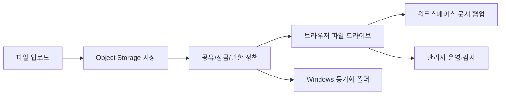
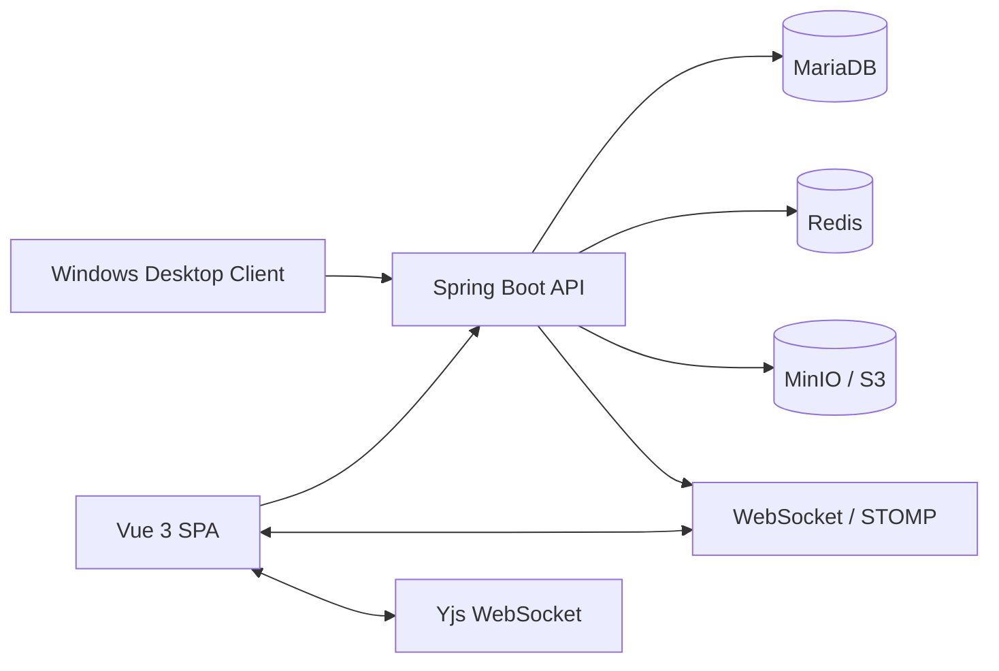

# FileInNOut Drive

> FileInNOut Drive는 웹 기반 파일 드라이브, 권한 기반 공유, 실시간 협업 문서, 관리자 운영 도구, Windows 동기화 클라이언트를 하나로 연결한 파일 협업 플랫폼입니다.

<p align="center">
  
</p>

<p align="center">
  <strong>Vue 3 · Spring Boot · MariaDB · Redis · MinIO/S3 · WebSocket/STOMP · Yjs · Docker · Kubernetes · Windows Desktop</strong>
</p>

## 프로젝트 요약

| 항목 | 내용 |
| --- | --- |
| 문제 | 파일 저장, 공유, 문서 협업, 운영 관리가 서로 다른 도구로 분리되어 생기는 작업 단절 |
| 해결 | 파일 생명주기와 공유 정책, 협업 문서, 관리자 운영 기능을 하나의 계정과 저장소 흐름으로 통합 |
| 형태 | 팀 프로젝트 기반 고도화 프로젝트 |
| 팀 담당 | 파일 업로드/다운로드, 공유·잠금 등 파일 기능과 관리자 기능을 팀원과 구현 |
| 개인 확장 | Windows tray 기반 동기화 클라이언트, Explorer 연동, 설치·제거·시작 프로그램 구성 |
| 배포 | Docker Compose 원클릭 실행과 Helm/Kubernetes 배포 구성 |

## 화면으로 보는 기능

<table>
  <tr>
    <td width="50%"></td>
    <td width="50%"></td>
  </tr>
  <tr>
    <td align="center"><strong>파일 드라이브</strong><br />업로드, 다운로드, 폴더, 잠금, 공유, 휴지통</td>
    <td align="center"><strong>관리자 운영</strong><br />사용자, 세션, 공유 감사, 저장소 분석</td>
  </tr>
</table>

<p align="center">
  
</p>

<p align="center"><strong>실시간 워크스페이스</strong><br />블록 문서, 댓글, 에셋, 멤버 권한, 검색, 백링크, 템플릿, 작업 관리</p>

<p align="center">
  
</p>

> 화면 자료에는 개인 정보와 운영 비밀값이 없습니다. 소개·로그인 화면은 현재 소스 기준 로컬 실행 캡처이며, 드라이브·워크스페이스·관리자 이미지는 프로젝트 UI 자료입니다.

## 핵심 사용자 흐름



| 영역 | 구현 기능 |
| --- | --- |
| 파일 관리 | 업로드 예약·완료 처리, 다운로드, 폴더 구조, 이동, 이름 변경, 휴지통, 최근 파일, 미리보기 |
| 공유·보호 | 사용자·그룹 공유, 읽기/쓰기 권한, 공유 링크, 만료 시간, 다운로드 제한, 비밀번호 보호, 파일 잠금 |
| 협업 | 실시간 공동 편집, 댓글, 멤버 초대, 에셋 첨부, 문서 검색, 백링크, 템플릿, 작업 보드 |
| 관리자 | 사용자 상태, 세션, 공유 감사, 저장소 분석, 요금제·할당량 관리 |
| 데스크톱 | Windows tray, 로컬 폴더 동기화, Explorer 메뉴, 시작 프로그램, 바로가기, 설치/제거 |

## 기술적 문제 해결

### 파일 저장과 DB 정합성

- Object Storage I/O와 DB 트랜잭션 경계를 분리했습니다.
- 업로드 예약량을 반영해 동시 업로드에서 저장소 할당량 초과를 방지했습니다.
- DB 참조가 없는 Object Storage 객체를 추적하는 orphan cleanup job과 검증 경로를 구성했습니다.

### 인증·실시간 연결 보안

- Refresh Token은 DB에 원문 대신 SHA-256 해시로 저장합니다.
- STOMP 연결은 Access Token만 허용하고, 연결 시 사용자 활성 상태를 확인합니다.
- OAuth 요청 쿠키는 AES-GCM 인증 암호화를 사용합니다.
- 운영 CORS는 `APP_CORS_ALLOWED_ORIGIN_PATTERNS`에 명시한 실제 origin만 허용합니다.

### 성능·유지보수성

- 관리자 저장소 분석의 사용자별 할당량 조회를 배치 조회로 변경했습니다.
- 전송 통계는 원본 이력 전체를 로드하지 않고 DB `GROUP BY` 집계로 계산합니다.
- SSE 연결을 인증 스토어 단일 소유로 정리해 중복 연결을 제거했습니다.
- 워크스페이스 대형 화면을 composable·component·service 단위로 분리했습니다.

## 아키텍처



## 품질 관리

| 구분 | 방식 |
| --- | --- |
| Frontend | Vitest, Vue Test Utils, Playwright 핵심 흐름 E2E |
| Backend | JUnit, Spring Boot Test, controller/service/security 테스트 |
| 배포 | Docker Compose health check, Helm template 검증 |
| 정적 검증 | 문서 인코딩 검증, 보안 경계, DB migration, deployment source, storage transaction 경계 |

최근 전체 검증 기준: 프론트 단위 테스트 681개, 백엔드 테스트 273개를 통과했습니다.

## 기술 스택

| 분야 | 기술 |
| --- | --- |
| Frontend | Vue 3, Vite, Pinia, Axios, Tailwind CSS, Vitest, Playwright |
| Backend | Java 17, Spring Boot, Spring Security, JPA, Gradle |
| Realtime | WebSocket, STOMP, Server-Sent Events, Yjs |
| Data | MariaDB, Redis, MinIO / S3 호환 Object Storage |
| Desktop | C# Windows Tray, Python Sync CLI, PowerShell Installer |
| DevOps | Docker, Docker Compose, Helm, Kubernetes, Jenkins |

## Quick Guide

Docker Desktop이 준비된 Windows PC에서는 아래 한 명령으로 MariaDB, Redis, MinIO, backend, realtime gateway, frontend를 기동합니다.

```powershell
.\quickstart.ps1
```

첫 실행은 로컬 전용 시크릿과 관리자 계정 생성, 이미지 build, 컨테이너 기동, backend/realtime/frontend health 확인을 처리합니다.

```text
App:           http://localhost:8088
MinIO console: http://localhost:9001
```

```powershell
# 상태 확인
.\quickstart.ps1 -Action Status

# 중지: 데이터 유지
.\quickstart.ps1 -Action Stop

# 초기화: 컨테이너와 MariaDB·Redis·MinIO 데이터 삭제
.\quickstart.ps1 -Action Reset
```

기본 포트가 사용 중이면 첫 실행에서 변경합니다.

```powershell
.\quickstart.ps1 -AppPort 8090 -MinioApiPort 9100 -MinioConsolePort 9101
```

생성된 `deploy/quickstart/.env`는 Git에서 제외됩니다. 자세한 사용법은 [Quickstart 문서](deploy/quickstart/README.md)를 참고합니다.

## 로컬 개발·테스트

```powershell
# frontend
cd frontend
npm install
npm run test:unit
npm run build

# backend
cd ..\backend
$env:JAVA_HOME='C:\jdk-17'
$env:Path="$env:JAVA_HOME\bin;$env:Path"
.\gradlew.bat test --no-daemon

# repository checks
cd ..
.\scripts\verify-local.ps1
```

## 운영 배포

Kubernetes 배포 source는 [`devops/Helm`](devops/Helm)입니다.

- 운영 배포에서 `latest` tag를 사용하지 않습니다.
- 명시 태그 또는 image digest로 backend, frontend, websocket 이미지를 배포합니다.
- CI/CD secret, private values, sealed secret 중 한 방식으로 민감 값을 주입합니다.
- Helm chart는 backend, frontend, websocket, MariaDB/Redis/MinIO 연동을 포함합니다.

## 디렉터리

```text
backend/          Spring Boot API, 보안, 도메인, 저장소 연동
frontend/         Vue SPA, 파일 드라이브, 워크스페이스, 관리자 UI
desktop-client/   Windows tray, 동기화, 설치·제거 스크립트
deploy/           Docker Compose Quickstart, two-VM helpers
devops/           Helm, Docker, Jenkins 배포 source
docs/             설계·운영 문서와 README 화면 자료
scripts/          로컬 통합 검증 스크립트
```

## 문서

- [아키텍처](docs/ARCHITECTURE.md)
- [사용자 흐름](docs/USER_FLOWS.md)
- [운영 Runbook](docs/RUNBOOK.md)
- [데스크톱 동기화 설계](docs/DESKTOP_SYNC_DESIGN.md)
- [배포 source 기준](devops/DEPLOYMENT_SOURCE.md)