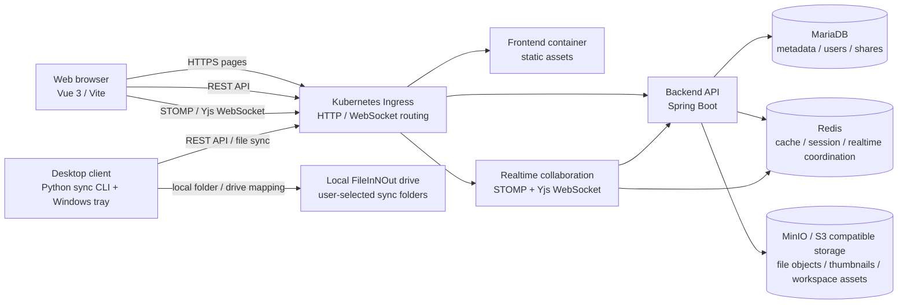

# FileInNOut Drive Architecture

이 문서는 현재 저장소 기준의 주요 컴포넌트 구성과 데이터 흐름을 정리합니다. 배포 source of truth는 `devops/Helm`이며, legacy manifest 경로는 직접 배포 입력으로 사용하지 않습니다.

## 컴포넌트 구성

## 주요 흐름

### 파일 업로드와 다운로드

1. 웹 또는 데스크탑 클라이언트가 백엔드 API에 업로드/다운로드 요청을 보냅니다.
2. 백엔드는 인증, 권한, 잠금, 공유 정책, 용량 정책을 검증합니다.
3. 실제 파일 객체는 MinIO/S3 호환 스토리지에 저장됩니다.
4. 파일 메타데이터, 공유 관계, 버전 정보는 MariaDB에 저장됩니다.
5. 다운로드 링크와 파일 본문은 권한 검증 뒤 반환됩니다.

### 공유와 잠금

1. 사용자는 파일, 폴더, 워크스페이스 문서를 공유하거나 잠급니다.
2. 백엔드는 사용자, 그룹, 관계 기반 권한을 계산하고 MariaDB에 상태를 저장합니다.
3. 프론트엔드는 공유 상태, 역할, 잠금 상태에 따라 편집/열람/첨부 UI를 전환합니다.
4. 데스크탑 클라이언트는 공유 폴더와 권한 정보를 동기화하고 로컬 쓰기 가능 여부를 반영합니다.

### 워크스페이스 작업

1. 브라우저는 워크스페이스 문서 편집 시 STOMP/Yjs WebSocket 경로로 연결합니다.
2. 실시간 서버는 presence, 변경 이벤트, 협업 편집 신호를 중계합니다.
3. 백엔드는 문서 제목, 본문, 댓글, 작업, 리뷰, 링크 관계를 API로 관리합니다.
4. Redis는 실시간 상태와 분산 coordination에 사용됩니다.

### 데스크탑 동기화

1. Windows tray 프로그램은 Python sync CLI를 호출해 로그인, 설정, 동기화, 상태 점검을 수행합니다.
2. 토큰은 Windows DPAPI/ProtectedData 기반 저장소를 사용합니다.
3. 로컬 FileInNOut drive는 사용자 선택 동기화 폴더와 API의 파일/공유 상태를 맞춥니다.
4. 충돌, 이동, 이름 변경, 읽기 전용 공유 파일 처리는 sync CLI에서 처리합니다.
5. 설치/제거 스크립트는 Start Menu, startup shortcut, 프로그램 제거 등록, Explorer integration을 관리합니다.

## 배포 경계

- Canonical Helm chart: `devops/Helm`
- Application images:
  - `chefbeom/fileinnoutdrive-backend:<explicit-tag>`
  - `chefbeom/fileinnoutdrive-frontend:<explicit-tag>`
  - `chefbeom/fileinnoutdrive-websocket:<explicit-tag>`
- 운영 배포는 `latest`를 사용하지 않고 명시 tag 또는 digest를 주입해야 합니다.
- Secret 값은 committed values가 아니라 private values, CI secret, Kubernetes Secret 중 하나로 주입합니다.
- `backend/helm`, `devops/Kubes`, `frontend/k8s`는 legacy compatibility artifact이며 직접 배포하지 않습니다.

## 데이터 저장 책임

| 영역 | 저장 위치 | 비고 |
| --- | --- | --- |
| 사용자, 권한, 공유, 파일 메타데이터 | MariaDB | transaction 기준 데이터 원본 |
| 파일 본문, 썸네일, 워크스페이스 첨부 | MinIO/S3 | DB와 불일치 가능성을 보상 작업으로 줄여야 함 |
| 세션 보조, 캐시, 실시간 coordination | Redis | 장애 시 재연결과 degrade 경로 필요 |
| 데스크탑 로컬 상태 | 사용자 로컬 폴더와 `.fileinnout` 상태 파일 | 사용자 데이터 보존 우선 |

## 현재 설계상 주의점

- 일부 백엔드 서비스는 저장소 I/O와 DB transaction 경계가 아직 두껍습니다. 업로드, 공유, 에셋 저장은 보상 작업 또는 cleanup job까지 설계해야 합니다.
- `WorkSpace.vue`와 데스크탑 클라이언트 파일은 책임이 커서 변경 영향 추적이 어렵습니다. composable/service/adapter 단위 분리를 계속 진행해야 합니다.
- legacy manifest는 차단 장치가 있지만 물리적으로 남아 있습니다. 외부 의존 경로가 정리되면 제거하거나 generated output으로 전환해야 합니다.
- Playwright E2E는 인증 흐름부터 시작했으며 업로드, 공유, 관리자 화면까지 확장해야 합니다.