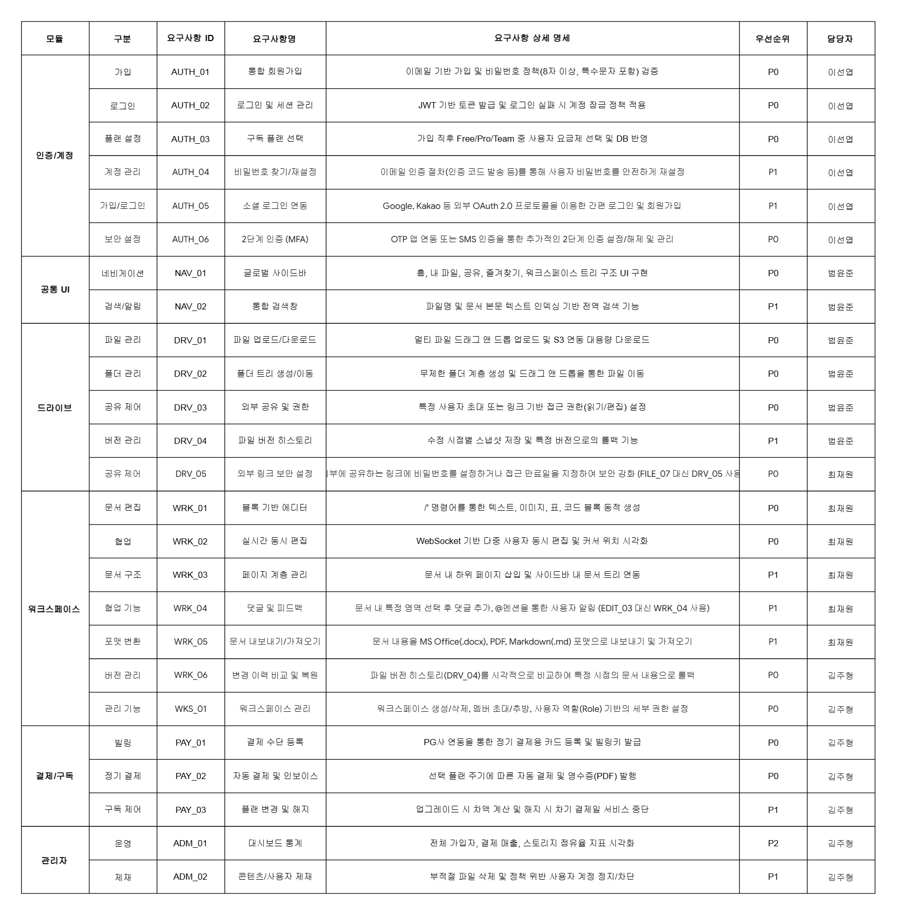
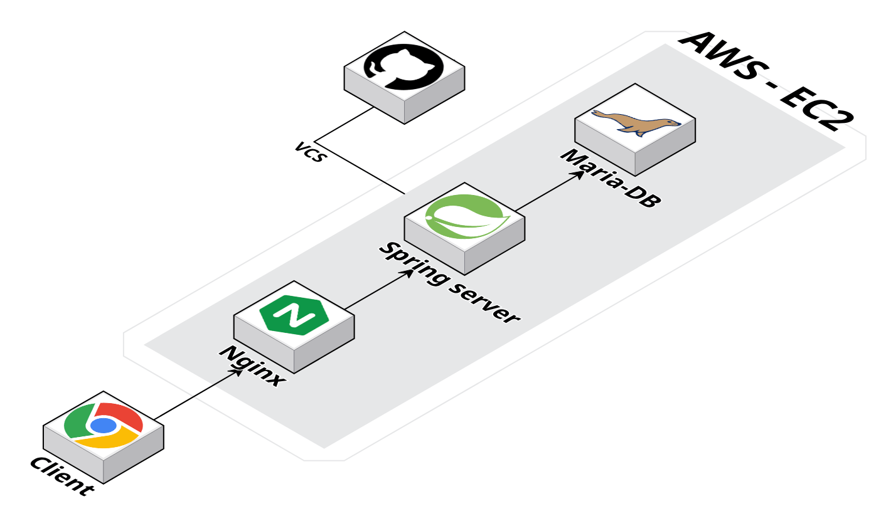
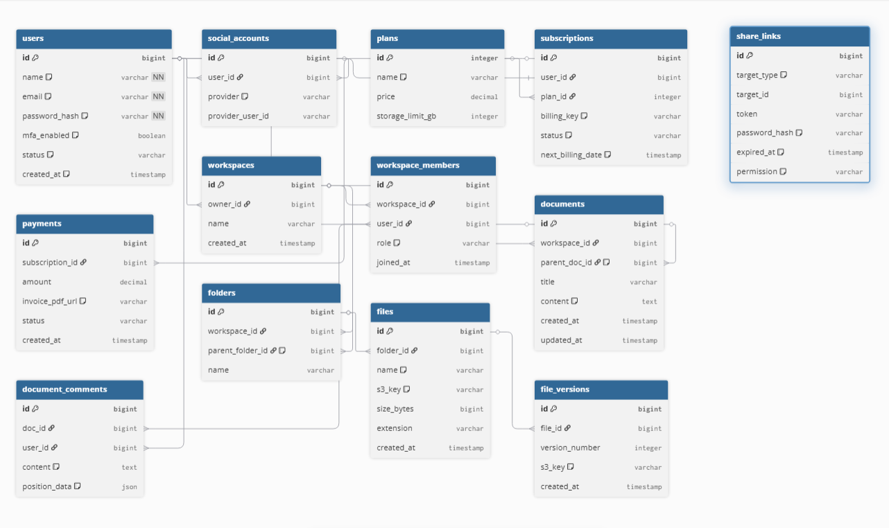
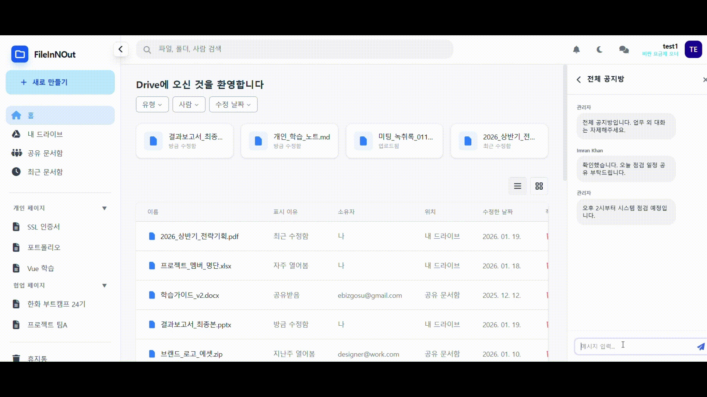
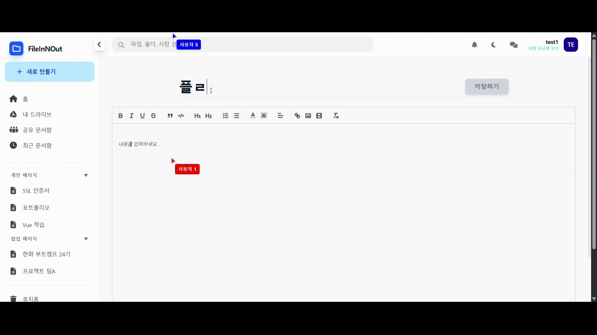

<!-- 타이틀 이미지 -->

<h3>파일 관리와 실시간 문서 협업의 경계를 허무는 하이브리드 워크스페이스</h3>

스마트한 <b>파일 저장소</b>와 강력한 <b>블록 기반 에디터</b>가 하나로 통합된 시스템입니다.
클라우드 스토리지의 안정성과 실시간 협업 경험을 동시에 제공합니다.

<table border="0" width="80%">
<tr>
<td align="center" colspan="4">
<b>TEAM MEMBER</b>
</td>
</tr>
<tr>
<td align="center" width="25%">
<a href="https://github.com/Joohyeng">

김주형
</a>
</td>
<td align="center" width="25%">
<a href="https://github.com/Yoonjoon13">

범윤준
</a>
</td>
<td align="center" width="25%">
<a href="https://github.com/sunyeoplee0">

이선엽
</a>
</td>
<td align="center" width="25%">
<a href="https://github.com/Lumisia">

최재원
</a>
</td>
</tr>
</table>

<a href="#프로젝트-소개">소개</a> &nbsp;|&nbsp;
<a href="#기술-스택">기술 스택</a> &nbsp;|&nbsp;
<a href="#요구사항-정의">요구사항</a> &nbsp;|&nbsp;
<a href="#피그마-프로토타입">피그마</a> &nbsp;|&nbsp;
<a href="#시스템-아키텍처">아키텍처</a> &nbsp;|&nbsp;
<a href="#데이터베이스-설계">ERD</a> &nbsp;|&nbsp;
<a href="#서비스-도메인">도메인</a>

<h2 id="프로젝트-소개">프로젝트 소개</h2>

<b>"전환 비용(Switching Cost)을 0으로 만드는 통합 환경"</b>

FileInNOut은 클라우드 저장소와 실시간 문서 협업 기능을 통합한 워크스페이스입니다.
웹상에서 팀원들과 동시에 문서를 작성하고 파일을 관리할 수 있는 환경을 제공합니다.

<h3>Problem & Solution</h3>

<table width="100%">
<tr>
<td width="50%" valign="top">
<h3>Problem (Pain Points)</h3>
<ul>
<li><b>데이터 파편화</b>: 파일 저장소와 문서 툴의 분리로 인한 업무 비효율</li>
<li><b>협업의 단절</b>: 폴더 구조 내에서 실시간 편집 중인 문서 식별의 어려움</li>
<li><b>복잡한 권한</b>: 파일 및 문서별 상이한 권한 설정 프로세스</li>
</ul>
</td>
<td width="50%" valign="top">
<h3>Solution (Key Values)</h3>
<ul>
<li><b>MinIO 오브젝트 스토리지</b>: 대용량 파일의 안정적인 저장 및 관리</li>
<li><b>Node.js & WebSocket</b>: 지연 없는 실시간 동시 편집 에디터 구현</li>
<li><b>하이브리드 구조</b>: 파일 트리 내 문서(Page) 무한 계층 생성 지원</li>
</ul>
</td>
</tr>
</table>

<h2 id="기술-스택">기술 스택</h2>

<h3>Backend & Storage</h3>

<h3>Frontend</h3>

<h3>Infrastructure</h3>

<h2 id="요구사항-정의">요구사항 정의</h2>

요구사항 정의서 상세 보기

<a href="docs/요구사항%20정의서.pdf">요구사항 정의서 다운로드 (PDF)</a>

<h2 id="피그마-프로토타입">피그마 프로토타입</h2>

피그마 프로토타입 상세 보기

<h2 id="시스템-아키텍처">시스템 아키텍처</h2>

시스템 아키텍처 상세 보기

<h2 id="데이터베이스-설계">데이터베이스 설계 (ERD)</h2>

데이터베이스 설계도(ERD) 상세 보기

 

<h2 id="서비스-도메인">서비스 도메인</h2>

<a href="http://www.innoutfile.kro.kr" target="_blank" rel="noopener noreferrer">

www.innoutfile.kro.kr

</a>

<h2 id="서비스-시나리오">서비스 시나리오 및 기능 데모</h2>

FileInNOut의 주요 핵심 기능을 시나리오별로 정리하였습니다. 각 항목을 클릭하여 상세 동작 과정과 데모 영상을 확인할 수 있습니다.

1. 사용자 인증 (회원가입 및 로그인)

.

계정 생성 및 보안 인증을 통한 사용자 접속 프로세스

2. 파일 및 문서 관리

파일 트리 구조 내 폴더/파일 업로드 및 문서(Page) 생성 관리

3. 채팅 기능

협업 중인 팀원들과의 실시간 소통 기능

4. 문서 편집기

</video>

블록 기반의 실시간 동시 편집 에디터

